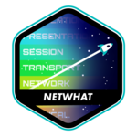

# Luis Geniole

> Behind the shell there's only daemons.

> When in doubt: [Pilgrim, Surfer, Doolittle, Bossanova and Trompe](https://www.youtube.com/watch?v=3Ep8X38tjTg&list=PLPHtlE3wckGN4VK-lH0sLBWDd7BQSDIob)

### My name is Luis and I like code

I started my career as a Rails and React developer at [Grupo Bio Ritmo](https://github.com/bioritmo).
I study Software Engineering at [42 São Paulo](https://www.42sp.org.br/).
I'm currently focusing on:

<table><tr>
<td>

- [Golang](https://golang.org/doc) & [Blockchain](https://en.wikipedia.org/wiki/Peer-to-peer)

</td>
<td>

- [C](https://devdocs.io/c) & [The Linux Kernel](https://github.com/torvalds/linux)

</td>
<td>

- [Solidity](https://docs.soliditylang.org/en/latest/) & [Haskell](https://www.haskell.org/documentation/)

</td>
<td>

- [Crystal](https://crystal-lang.org/docs/)

</td>
</tr></table>

### Languages I'm comfortable with

[<code></code>](https://devdocs.io/c/)
[<code></code>](https://isocpp.org/std/the-standard)
[<code></code>](https://www.mathworks.com/help/matlab/)
[<code></code>](https://developer.mozilla.org/en-US/docs/Web/JavaScript/Reference)
[<code></code>](https://www.typescriptlang.org/docs)
[<code></code>](https://hexdocs.pm/elixir/Kernel.html)
[<code></code>](https://www.ruby-lang.org/en/documentation/)
[<code></code>](https://www.python.org/doc/)
[<code></code>](https://devdocs.io/bash/)
[<code></code>](https://golang.org/doc/)

### Techs I've used

[<code></code>](https://hexdocs.pm/phoenix/Phoenix.html)
[<code></code>](https://guides.rubyonrails.org/)
[<code></code>](https://relishapp.com/rspec)
[<code></code>](https://nodejs.org/en/docs/)
[<code></code>](https://expressjs.com/en/4x/api.html)
[<code></code>](https://nextjs.org/docs)
[<code></code>](https://webpack.js.org/concepts/)
[<code></code>](https://reactjs.org/docs/getting-started.html)
[<code></code>](https://jestjs.io/docs/en/getting-started.html)
[<code></code>](https://socket.io/docs/)
[<code></code>](https://graphql.org/learn/)
[<code></code>](https://getbootstrap.com/docs/4.1/getting-started/introduction/)
[<code></code>](https://sass-lang.com/documentation)
[<code></code>](https://docs.docker.com/compose/)
[<code></code>](https://redis.io/documentation)
[<code></code>](https://sequelize.org/master/)
[<code></code>](https://typeorm.io/)
[<code></code>](https://adonisjs.com/docs/4.1/lucid)
[<code></code>](https://www.postgresql.org/docs/)
[<code></code>](https://dev.mysql.com/doc/)
[<code></code>](https://sqlite.org/docs.html)
[<code></code>](https://git-scm.com/doc)
[<code></code>](https://docs.github.com/en)
[<code></code>](https://www.markdownguide.org/getting-started)
[<code></code>](https://docs.aws.amazon.com/index.html)
[<code></code>](https://jupyterlab.readthedocs.io/en/stable/)
[<code></code>](https://confluence.atlassian.com/jira061)
[<code></code>](https://www.kernel.org/doc/html/latest/)
[<code></code>](https://help.ubuntu.com/)
[<code></code>](https://www.raspberrypi.org/documentation/)
[<code></code>](https://www.arduino.cc/reference/en/)
[<code></code>](https://curl.haxx.se/docs/)
[<code></code>](https://www.gnu.org/software/emacs/documentation.html)

### Things I wanna learn

[<code></code>](https://www.haskell.org/documentation/)
[<code></code>](https://crystal-lang.org/docs/)
[<code></code>](https://doc.rust-lang.org/std/index.html)
[<code></code>](https://developer.mozilla.org/en-US/docs/WebAssembly)
[<code></code>](https://clojure.org/api/api)
[<code></code>](https://www.lua.org/docs.html)
[<code></code>](https://www.tensorflow.org/guide/)
[<code></code>](https://www.electronjs.org/docs)
[<code></code>](https://ethereum.org/en/developers/)
[<code></code>](https://solidity.readthedocs.io/en/v0.7.0/)
[<code></code>](https://www.jenkins.io/doc/tutorials/)
[<code></code>](https://docs.ansible.com/)

### 42 - Projects

[<code></code>](https://docs.google.com/presentation/d/1jQFeNh26VdVB7vO-ZypKq3XRiO2zCfAMUdEyJkXh_Ts/edit?usp=sharing)
[<code></code>](https://github.com/librity/ft_libft)
[<code></code>](https://github.com/librity/ft_get_next_line)
[<code></code>](https://github.com/librity/ft_netwhat)
[<code></code>](https://github.com/librity/ft_printf)
[<code></code>](https://github.com/librity/ft_born2beroot)
[<code></code>](https://github.com/librity/ft_fractol)
[<code></code>](https://github.com/librity/ft_pipex)

### Live Apps

<table><tr>
<tr><th> React </th></tr>
<tr>
<td>

- [Blockchain mining simulator](https://create-react-mine.vercel.app)
- [Tech Blog Demo](https://tech1776.netlify.app/)
- [Better Momentum clone](https://impetus.vercel.app/)

</td>
<td>

- [NGO/Charity System](https://bethehero1776.netlify.app/)
- [Gym Management System](https://gympoint1776.netlify.app/)
- [Barbershop Management System](https://gobarber1776.netlify.app/)

</td>
<td>

- [To do List](https://todo1776.netlify.app/)
- [Landing Page Demo](https://iworldtrip.netlify.app/)
- [Workshop Landing Page](https://genioledesigns.netlify.app/)

</td>
<td>

- [Pomodoro with stretching](https://moveit-lfwxit6xp-librity.vercel.app/)
- [Ugly Github Explorer](https://githubrepos1776.netlify.app/)
- [Pretty Github Explorer](https://github1776.netlify.app/)

</td>
</tr></table>

<table><tr><tr>

<th> Go </th>
<th> Hugo </th>
<th> Rails </th>
<th> Node </th>
<th> Elixir </th>

</tr><tr>
<td>

- [Minimal Wiki](https://wiki1776.herokuapp.com/)
- [Web Scrapper](https://nc-gojobs.herokuapp.com/)

</td>
<td>

- [My Tech Blog](https://42devdiaries.netlify.app/)
- [Production-ready template](https://hugonetlifytemplate.netlify.app/)

</td>
<td>

- [Twitter Clone](https://sampleapp1776.herokuapp.com/)

</td>
<td>

- [Zoom Clone](https://zoomclone1776.herokuapp.com/)
- [Momentum Clone](https://nomentum.herokuapp.com)

</td>
<td>

- [Food Delivery API](https://github.com/librity/ignite_rockelivery)

</td>
</tr></table>
