# Luis Geniole

### How's it going?

- 🔭 **I’m currently working on:** @42SaoPaulo, my job, Rails, Express, React and React Native
- 🌱 **I’m currently learning:** [Rust 🦀💓](https://www.rust-lang.org/), [Web Assembly](https://webassembly.org/), [Ember](https://emberjs.com/learn/), [GR](https://www.youtube.com/playlist?list=PLDlWMHnDwyliqBCB4JaugtpCZXR9-k7s0), [QFT](https://www.youtube.com/playlist?list=PLPH7f_7ZlzxTi6kS4vCmv4ZKm9u8g5yic), [Electron](https://www.electronjs.org/), [Ethereum + Solidity](https://solidity.readthedocs.io/en/v0.7.0/)
- 🤝 **I’m looking to collaborate on:** Pretty much anything, I love pair programming.
- 🤔 **I’m looking for help with:** All the above ☝️
- 💬 **Ask me about:** Ruby, Rails, React, Node, Physics, Math, Electronic and Petroleum Engineering
- 📫 **How to reach me:** luis.geniole@gmail.com (I check it almost every day)

### Languages

[<code></code>](https://devdocs.io/c/)
[<code></code>](https://isocpp.org/std/the-standard)
[<code></code>](https://www.mathworks.com/help/matlab/)
[<code></code>](https://developer.mozilla.org/en-US/docs/Web/JavaScript/Reference)
[<code></code>](https://www.typescriptlang.org/docs)
[<code></code>](https://www.ruby-lang.org/en/documentation/)
[<code></code>](https://www.python.org/doc/)
[<code></code>](https://devdocs.io/bash/)

### Techs

[<code></code>](https://guides.rubyonrails.org/)
[<code></code>](https://relishapp.com/rspec)
[<code></code>](https://nodejs.org/en/docs/)
[<code></code>](https://expressjs.com/en/4x/api.html)
[<code></code>](https://nextjs.org/docs)
[<code></code>](https://webpack.js.org/concepts/)
[<code></code>](https://reactjs.org/docs/getting-started.html)
[<code></code>](https://jestjs.io/docs/en/getting-started.html)
[<code></code>](https://socket.io/docs/)
[<code></code>](https://graphql.org/learn/)
[<code></code>](https://getbootstrap.com/docs/4.1/getting-started/introduction/)
[<code></code>](https://sass-lang.com/documentation)
[<code></code>](https://docs.docker.com/compose/)
[<code></code>](https://redis.io/documentation)
[<code></code>](https://sequelize.org/master/)
[<code></code>](https://typeorm.io/)
[<code></code>](https://adonisjs.com/docs/4.1/lucid)
[<code></code>](https://www.postgresql.org/docs/)
[<code></code>](https://dev.mysql.com/doc/)
[<code></code>](https://sqlite.org/docs.html)
[<code></code>](https://git-scm.com/doc)
[<code></code>](https://docs.github.com/en)
[<code></code>](https://www.markdownguide.org/getting-started)
[<code></code>](https://docs.aws.amazon.com/index.html)
[<code></code>](https://jupyterlab.readthedocs.io/en/stable/)
[<code></code>](https://confluence.atlassian.com/jira061)
[<code></code>](https://www.kernel.org/doc/html/latest/)
[<code></code>](https://help.ubuntu.com/)
[<code></code>](https://www.raspberrypi.org/documentation/)
[<code></code>](https://www.arduino.cc/reference/en/)
[<code></code>](https://curl.haxx.se/docs/)
[<code></code>](https://www.gnu.org/software/emacs/documentation.html)

### Learning

[<code></code>](https://doc.rust-lang.org/std/index.html)
[<code></code>](https://developer.mozilla.org/en-US/docs/WebAssembly)
[<code></code>](https://hexdocs.pm/elixir/Kernel.html)
[<code></code>](https://hexdocs.pm/phoenix/Phoenix.html)
[<code></code>](https://clojure.org/api/api)
[<code></code>](https://www.lua.org/docs.html)
[<code></code>](https://guides.emberjs.com/release/)
[<code></code>](https://www.tensorflow.org/guide/)
[<code></code>](https://www.electronjs.org/docs)
[<code></code>](https://ethereum.org/en/developers/)
[<code></code>](https://solidity.readthedocs.io/en/v0.7.0/)
[<code></code>](https://www.jenkins.io/doc/tutorials/)

### [42 S. Paulo 🥰](https://www.42sp.org.br/)

<code>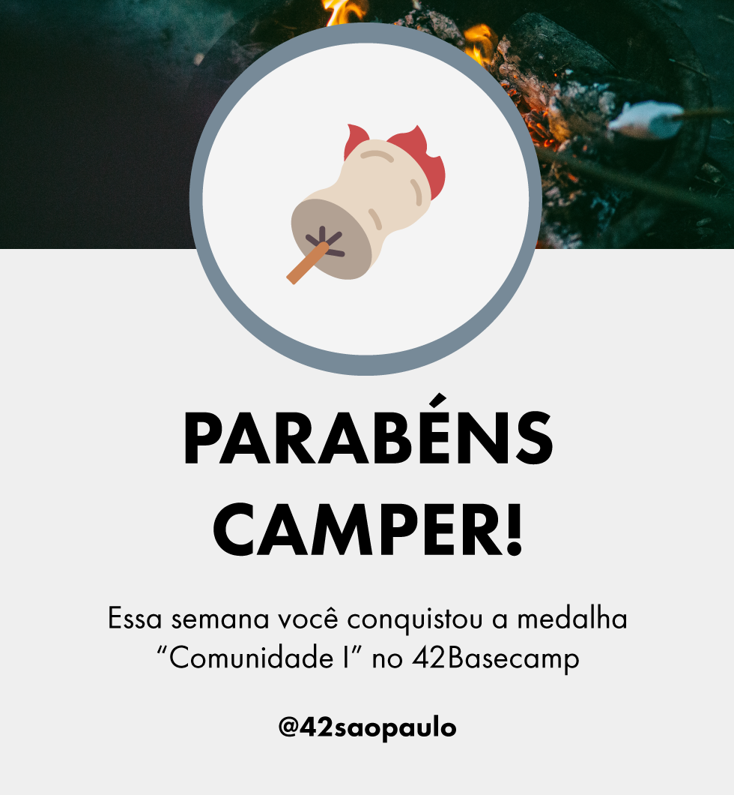</code>
<code>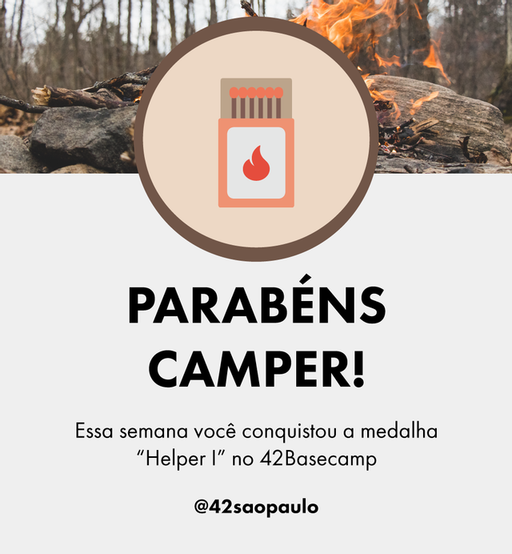</code>
<code>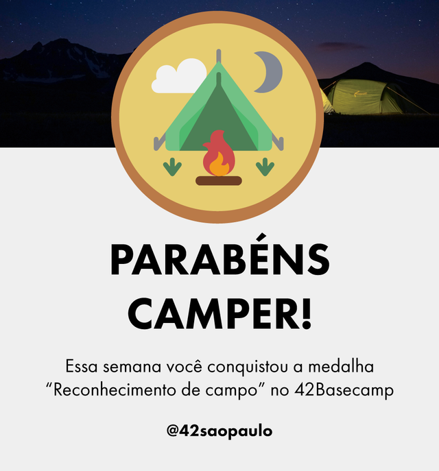</code>
<code>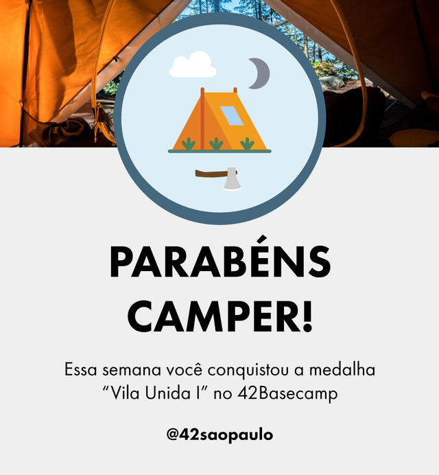</code>

<code>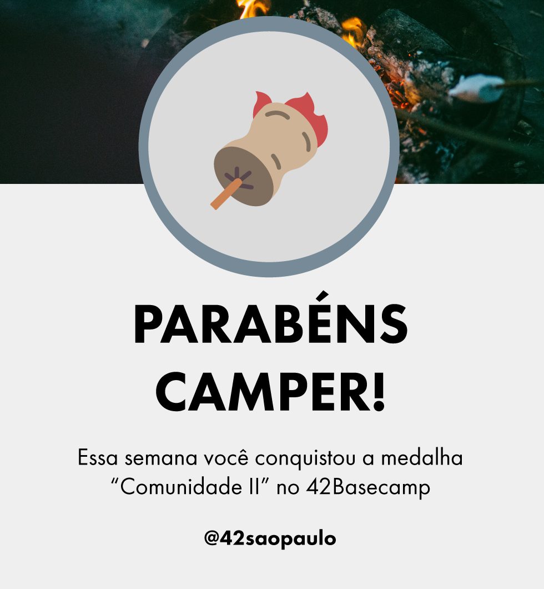</code>
<code>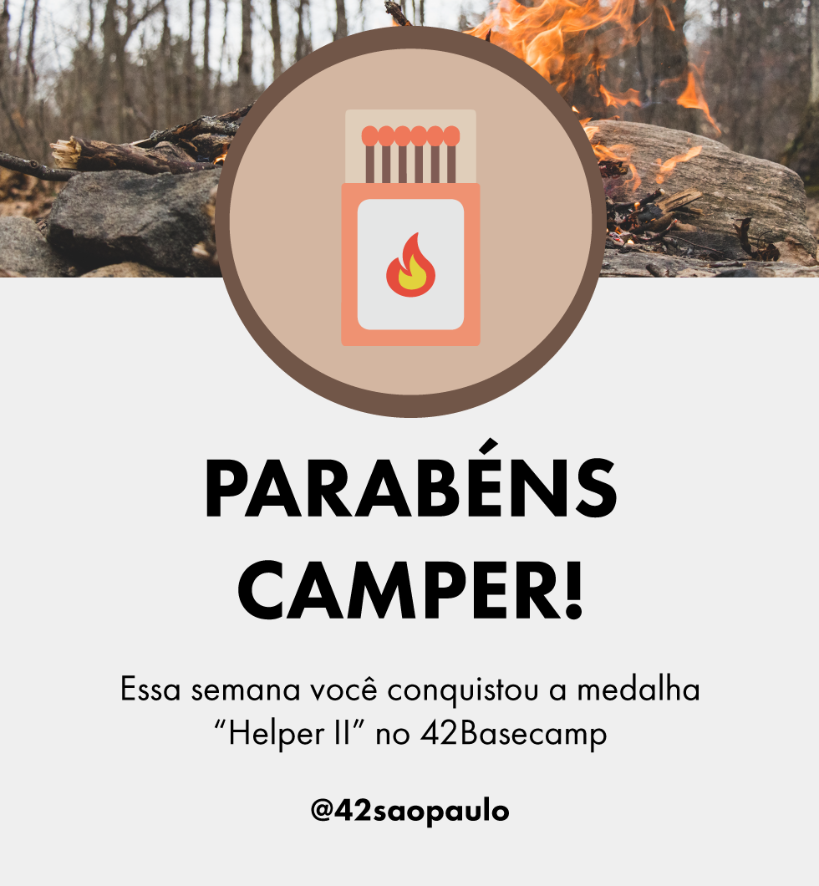</code>
<code>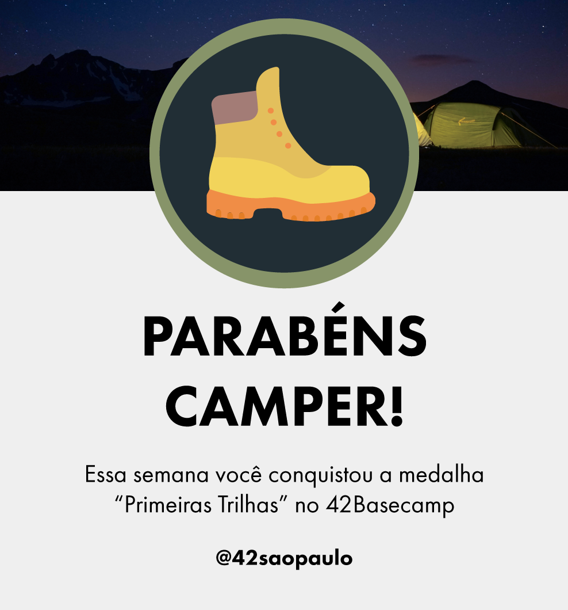</code>
<code></code>

<code>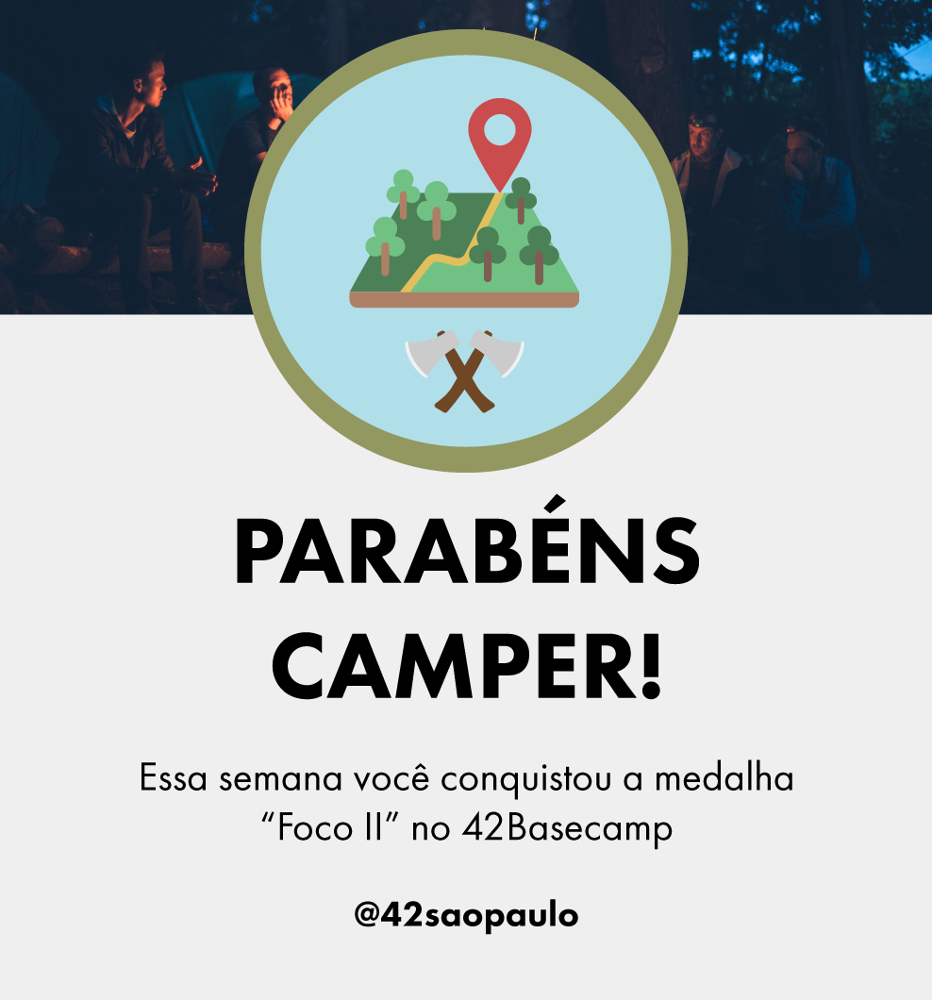</code>
<code>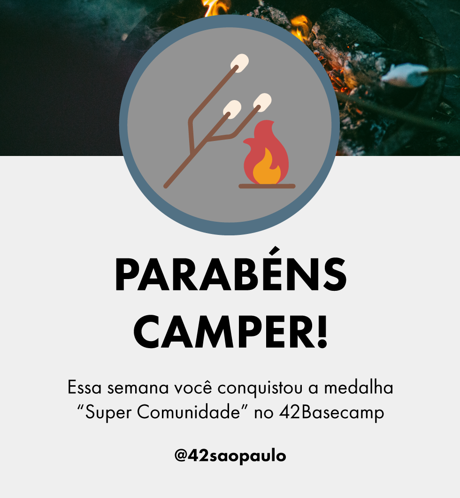</code>
<code></code>
<code>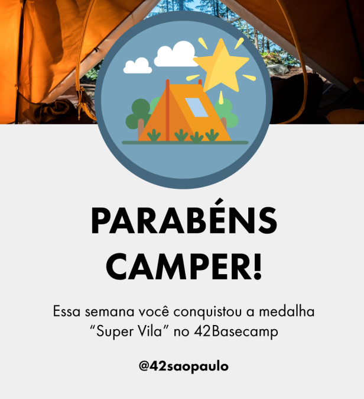</code>

<code>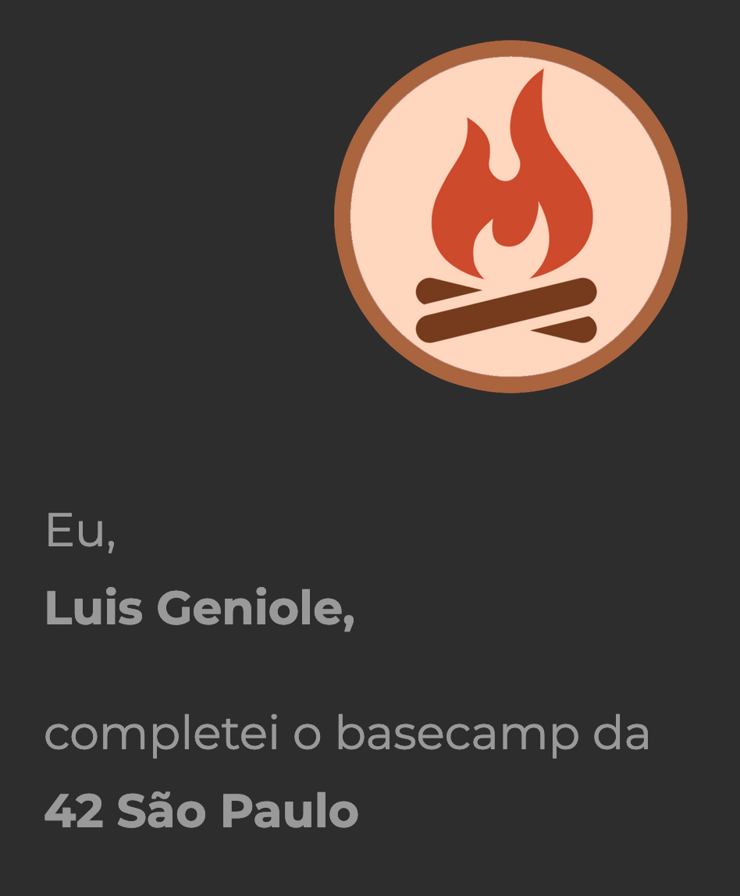</code>

### Stats :octocat:

  <table>
    <tr>
      <td></td>
      <td></td>
    </tr>  
  </table>

  
Portifolio

  
  #### Rails

  - https://sampleapp1776.herokuapp.com/
  - https://neodesk.herokuapp.com/
  
  #### Node

  - https://www.tuttoinlegno.com.br/
  - https://github1776.netlify.app/
  - https://gobarber1776.netlify.app/
  - https://gympoint1776.netlify.app/
  - https://bethehero1776.netlify.app/
  - https://githubrepos1776.netlify.app/

